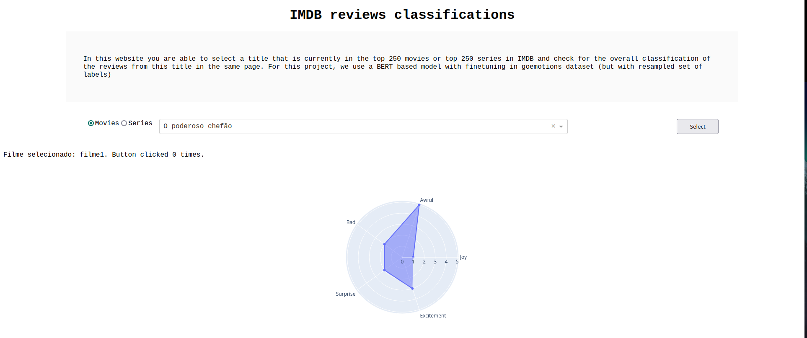

# Sentiment Analysis on IMDB Reviews

Nowadays, services as Amazon Prime, Netflix and HBO have lots of interesting series and movies to watch. Because of the number large number of products available,
sometimes it is difficult to know the emotions hide in each one. With this project, we aim to produce a ML Model capable of predicting sentiments like anger and happiness of audiovisual content based on reviews from IMDB.

## Authors

- [@allthecoder](https://github.com/allthecoder)
- [@bmarquescost](https://github.com/bmarquescost)
- [@vitorfrois](https://www.github.com/vitorfrois)


## Features

- Scrape reviews from IMDB
- Train the model with Go Emotions dataset.
- Predict sentiments and visualize results at dashboard with graphs

## Screenshots




## Installation

Run the docker project with

```bash
  make up
```
Access the Dash App at [http://0.0.0.0:5000/](http://0.0.0.0:5000/) to visualize results.

Do not forget to pause the container after using it 
```bash
  make down
```
    
## Tech Stack

**ML:** PyTorch

**Datasets**: GoEmotions, IMDB Reviews

**App**: Dash

**Other**: Docker
